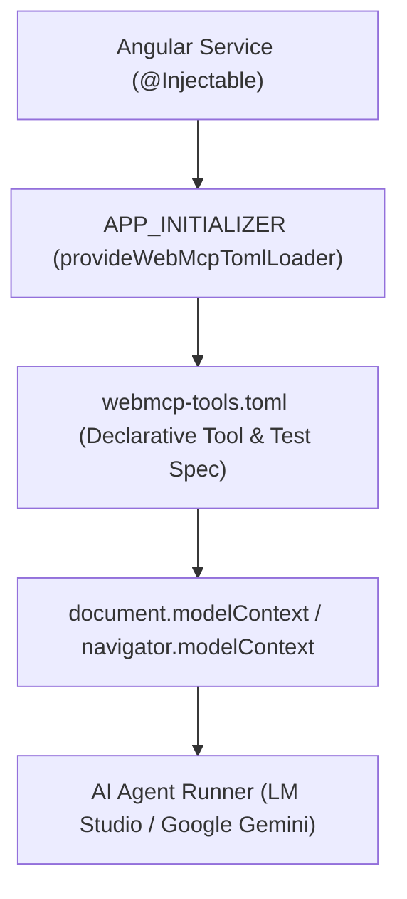
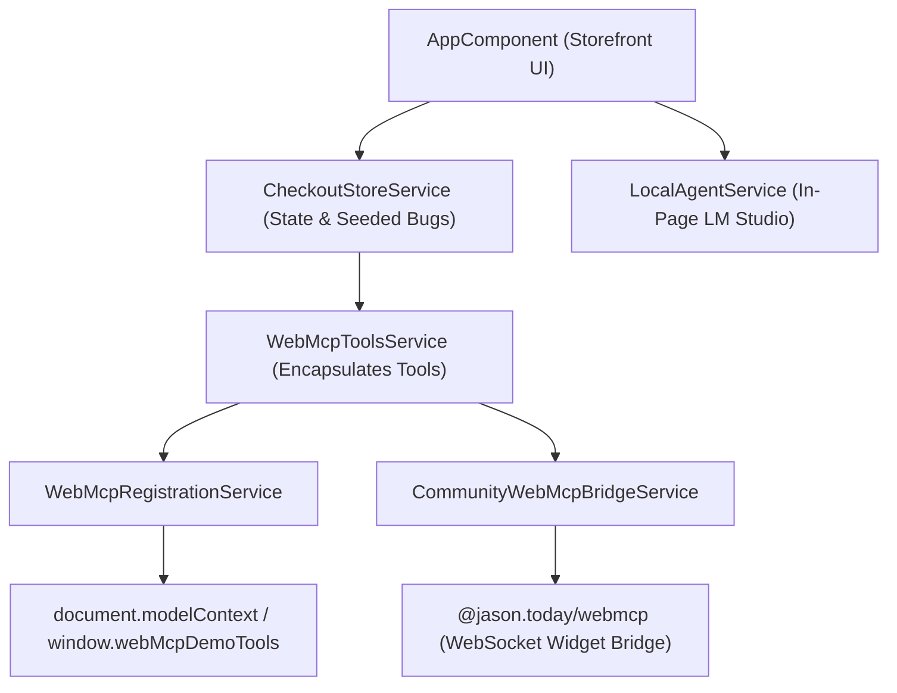

# The web is not just for humans anymore!

<!-- fragment -->
> The internet was originally built for humans. We designed buttons, dropdowns, and forms for people to read, understand, and use. 
But now there’s a new type of user emerging: **`AI agents`.** Soon they’ll be able to complete registrations, buy tickets, and take any action needed to complete a goal on a website.

<!-- fragment -->
>They must crawl websites and reverse-engineer how everything works. 
For example, to book a flight, an agent needs to identify the right input fields, guess the correct data format, and hope nothing breaks in the process. It’s inefficient.

<!-- fragment -->

## What can we do about this?

<!-- fragment -->
> We can use WebMCP standard which will solve this issue by exposing the structure of these tools so AI agents can understand and perform better.

---


---

# So... What is WebMCP?

<!-- fragment -->

**`WebMCP`** is a proposed web standard to help you build and expose structured tools for AI agents. 
WebMCP provides JavaScript and annotates HTML form elements so that agents know exactly how to interact with page features, to support a user's experience. 
This can significantly improve the performance and reliability of agent actuation.

<!-- fragment -->
> `Actuation` is the act of an agent simulating manual mouse clicks and text input, as though it were the human user engaging with your website. 
These can be single tasks, such as clicking a link or inputting content into a form, or complex tasks, such as completing a purchase.

<!-- fragment -->
**WebMCP is a joint effort between Google and Microsoft, with engineers from the Chrome and Edge teams driving the spec.**

---

# Why WebMCP?

WebMCP can help you

```text
- Bridge the gap between web applications and agents
- Improve efficiency, 
- Improve reliability, 
- Improve task completion, 

by providing rules for interaction.

```
<!-- fragment -->
```text
- Instead of an agent reviewing the element, such as a button or a field, to understand its purpose, the website declares the element's purpose, so it's used correctly
- This is more reliable than actuation, which may have numerous steps and leaves each step open to interpretation by the agent.

```
>The web MCP standard provides a way to build and expose structured tools for AI agents. It allows them to understand and interact with web pages more reliably, improving efficiency and task completion. Instead of guessing how elements work, agents can use the provided information to act with confidence.

---

# So... What does this means for QA Engineers?

<!-- fragment -->
## Without WebMCP:
- An AI agent would crawl the page looking for a button that would say something like `Book a Flight` or `Search Flights`. 
The agent reads the screen, guesses which fields need what information, and hopes the form accepts its input.

<!-- fragment -->
## With WebMCP:
- Instead of thinking “I need to find a ‘Book a Flight’ button,” the agent thinks “I need to call the bookFlight() function with clear parameters (date, origin/destination, passengers) and receive a structured result. 
The agent doesn’t search for visual elements. It calls a function, just like developers do when working with APIs.

---

# How to Implement WebMCP

In the same way that mobile-first design changed how we build websites, agent-ready design could define the next generation of web applications.

<!-- fragment -->

## WebMCP gives developers two ways to make their websites agent-ready:

<!-- fragment -->

- ### Imperative API

Define tools programmatically through a new browser interface called `navigator.modelContext` or `document.modelContext`. 
You register a tool by giving it a name, a description, an input schema, and an execute function.


<!-- fragment -->

- ### Declarative API

Transforms standard HTML forms into agent-compatible tools by adding a few HTML attributes.

---

# Imperative API

<!-- highlight: 1 -->
<!-- highlight: 2,13 -->
<!-- highlight: 2-13 -->

```typescript
const modelContext = document.modelContext || navigator.modelContext;
modelContext.registerTools([
  {
    name: "userservice_login", 
    description: "Login to the system",
    inputSchema: {
      properties: { email: { type: "string" }, password: { type: "string" } },
      required: ["email", "password"],
    },
    execute: async (args) => {
      return await this.userService.login(args.email, args.password);
    },
  },
]);
```

---

# Declarative API
<!-- highlight: 1-5 -->
```html
<form toolname="bookFlight"
    tooldescription="Book a flight"
    toolautosubmit
    action="/reservations"
>
  <input name="date" type="date" required />
  <input name="origin" type="text" required />
  <input name="destination" type="text" required />
  <button type="submit">Book Flight</button>
</form>
```

---

# Caveat

The API was officially moved from `navigator` to `document` in the May 27, 2026 W3C spec draft.  
The reasoning is that tools belong to a specific page (the document) rather than the browser (the navigator).

## Current Status (August 2026)

- **Canonical Location**: `document.modelContext`
- **Deprecated Location**: `navigator.modelContext` (Deprecated in Chrome 150)
- **Compatibility**: The old `navigator` name still works as an alias in current browsers to prevent breaking existing code, but it triggers a deprecation warning in the console.


```js
// For now to ensure your code works across both older and newer browser versions, use feature detection:
const modelContext = document.modelContext || navigator.modelContext;
```

---

# FAQ
### * Is WebMCP the same as MCP?
<!-- fragment -->
No. MCP runs as a separate server. WebMCP runs inside the browser tab and inherits the user’s authenticated session. They’re complementary. A real B2B product will usually want MCP for anything that runs without a user present, and WebMCP for anything that needs the user’s permissions and the current page state.
<!-- fragment -->
### * Do I need WebMCP if I already have a public API?
<!-- fragment -->
Yes, No, Maybe? if you have a customer-facing UI. APIs cover backend operations, WebMCP exposes the UI flows to AI agents with the user’s session and permissions already attached.
<!-- fragment -->
### * When will WebMCP be production-ready?
<!-- fragment -->
Native browser support is expected across Chrome and Edge in the second half of 2026. Until then, polyfills let you experiment and prototype with current browsers.
<!-- fragment -->
### * Does WebMCP replace SEO?
<!-- fragment -->
No. WebMCP is the execution layer on top of the visibility foundation you’ve already built using SEO.
<!-- fragment -->
### * How is WebMCP different from Playwright or browser automation?
<!-- fragment -->
Playwright and similar tools simulate a human user, clicking buttons and filling fields. WebMCP exposes structured functions directly. The agent calls the function and gets a typed response, instead of inferring intent from pixels and DOM nodes or using AI Vision.

---


# WHOAMI

<!-- columns: 2 -->

**Just a guy figuring things out and not afraid to show my mess or my beautiful solutions.**

**My name is Alex Muturi**

You can find me on :
- Twitter X: [@MuturiAlex](https://x.com/MuturiAlex)
- LinkedIn: [Alex Muturi](https://linkedin.com/in/alex-muturi)
- Blog: [alex-migwi.github.io](https://alex-migwi.github.io)
- GitHub: [alex-migwi](https://github.com/alex-migwi)
- Medium: [alex-migwi.medium.com](https://alex-migwi.medium.com)

**I also write Angular stuff on [angularrecipes.dev](https://angularrecipes.dev)**

<!-- col-break -->


> Note: Welcome everyone! Today we're diving into WebMCP—the Web Model Context Protocol—and exploring how it transforms web application testing from brittle UI scripts into self-healing, autonomous AI agent workflows.

---


# 🧪 Autonomous Web QA using WebMCP

## Exposing Angular Components & Services to AI Agents & possibly get self-healing code & tests

---

# 💥 The Testing Crisis

## Why Traditional Test Automation Breaks

<!-- fragment -->
<!-- columns: 2 col -->


### 🛠️ Brittle UI Selectors
- Dynamic CSS classes and DOM restructuring constantly break Cypress, Playwright, and Selenium tests.
- Teams waste up to 30% of sprint velocity maintaining fragile locator strategies.

<!-- fragment -->
<!-- col-break -->

### 👁️ Black-Box Blindness
- E2E runners click buttons without visibility into internal application state or service logic.
- Traditional tests verify pre-defined assertions; they cannot adapt to unexpected edge cases or suggest code fixes.

<!-- duration: 12s -->

> Note: Traditional E2E testing treats the application as a black box. WebMCP flips this paradigm by exposing standard Angular code & contracts directly to AI models.

---

# 💡 Approach Comparison: Two WebMCP Architectures

## We explore two distinct implementation approaches for Angular WebMCP QA:

<!-- columns: 2 -->
1. **`angular-webmcp-qa-demo` (Third Party Angular Library + TOML configuration)**: Uses [`ng-webmcp`](https://github.com/nicoavanzdev/ng-webmcp) and an `APP_INITIALIZER` loader to automatically expose `@Injectable()` service methods into `navigator.modelContext` based on `webmcp-tools.toml`.

<!-- col-break -->
2. **`webmcp-qa-demo` (Imperative Store & Dual-Bridge Approach)**: Explicitly registers structured Angular store tools into `document.modelContext` and mirrors them via the `@jason.today/webmcp` WebSocket bridge to external AI clients (LM Studio, Codex).

---

# 🏗️ Architecture 1: Third Party Library (ng-webmcp) 

## How Service Ingestion Works



- **Auto Mode (`mode = "auto"`)**: Automatically reflects all public methods on a service class (e.g., `UserService` -> `userservice_login`).
- **Explicit Mode (`mode = "explicit"`)**: Selectively exposes specific methods with custom descriptions (e.g., `PaymentService` -> `paymentservice_processpayment`).

### Project Link: [Using ng-webmcp + toml](https://github.com/alex-migwi/angular-webmcp-qa-demo)

> Note: This architecture uses Angular's APP_INITIALIZER provider to fetch and parse webmcp-tools.toml at boot time before components mount.

---

# Key Features
- **Decorator Syntax**: Allows developers to expose methods as AI tools using the @WebmcpTool() decorator on Angular services, avoiding boilerplate code. 
- **Automatic Lifecycle Management**: Automatically registers tools when a service is instantiated and unregisters them when destroyed, preventing memory leaks. 
- **Framework Agnostic Core**: Wraps the underlying document.modelContext API (handling the transition from the deprecated navigator API) and provides polyfills for testing in browsers without native support. 
- **Standalone & Module Support**: Provides both provideWebmcp() for modern standalone apps and WebmcpModule for legacy NgModule architectures. 

---

# 📄 Declarative Schema: TOML Tool Specs

## Co-Locating Tool Declarations & Test Suites

```toml
# 1. Register UserService tools automatically
[[tools]]
class = "UserService"
mode = "auto"

# 2. Register PaymentService tools explicitly
[[tools]]
class = "PaymentService"
mode = "explicit"
methods = ["processPayment", "refund", "applyDiscount"]
[tools.description_overrides]
processPayment = "Process a credit card payment securely"

# 3. Declarative Test Plan
[[tests]]
name = "auth_and_payment_flow"
steps = [
  { tool = "userservice_login", args = { user = "alex@example.com", pass = "Secret123" }, assert = { success = true } },
  { tool = "paymentservice_applydiscount", args = { price = 200, discountPercent = 15 }, assert = { finalPrice = 170 } }
]
```

> Note: Tools, metadata, and test assertions live together in a single human-readable TOML specification file.

---

# 🏗️ Architecture 2: The Polyfill/Bridge (jason.today/webmcp)

## Decoupled Domain Logic & Tool Layer



- **`WebMcpToolsService`**: Wraps store methods into typed WebMCP schema tool definitions (`get_checkout_state`, `set_quantity`, `place_order`).

### Project Link: [@jason.today/webmcp Community Bridge](https://github.com/alex-migwi/webmcp-qa-demo)

> Note: Requires ngZone to access Angular Injection Context.

---

# 🔌 Key Features

> The original pre-standard implementation by Jason McGhee, designed to work today before native browser support is universal.

- **Core Function**: Acts as a localhost WebSocket bridge between your AI client and the browser. 
- **Key Feature**: Framework-agnostic & Immediate. Works on any site (Vanilla, React, etc.) via a simple script tag and a manual one-time token handshake. 
- **Use Case**: Best for testing and prototyping on existing sites without waiting for browser updates. 

> Note: By supporting both native document.modelContext and the community WebSocket bridge, the app allows testing from both inside the browser and external MCP client tools.

---

# 🩹 Self-Healing Code Patches

## What to expect for Autonomous Fix Generation for Buggy Services???

<!-- columns: 2 -->

### ❌ Failing Code (`payment.service.ts`)
```typescript
applyDiscount(price: number, percent: number) {
  // Bug: Direct subtraction instead of percentage
  return price - percent; 
}
```

<!-- col-break -->

### ✅ AI Agent Patch (`payment.service.ts`)
```typescript
applyDiscount(price: number, percent: number) {
  // Fixed: Correct percentage calculation
  return price * (1 - percent / 100); 
}
```

<!-- duration: 15s -->

> Note: Rather than stopping at simple failure logs, you can allow/instruct the AI agent to use WebMCP tool metadata to propose exact code fixes for the developer.

---

# ⚡ Model Choice: Local vs Cloud

## Flexibility in Autonomous QA Execution

| Feature | Local LLM (LM Studio) | Cloud LLM (Google Gemini) |
|---|---|---|
| **Privacy / Security** | 100% On-Premise / Air-Gapped | Encrypted in Transit |
| **Model Support** | Qwen 2.5 Coder, Gemma, Phi-3 | Gemini 3.5 Flash / Pro |
| **Performance** | Hardware Dependent (GPU/NPU) | High-Throughput Cloud Scale |
| **Execution Cost** | Completely Free | Token-based API billing |
| **CLI Runner** | `npm run test:lm-studio` | `npm run test:gemini` |

> Note: You can switch seamlessly between offline open-weights models and scalable cloud APIs.

---

# 🎯 Key Takeaways & Next Steps

## The Future of Web QA with WebMCP

- 1️⃣ **Native Browser Capabilities**: WebMCP turns Angular services into standardized AI tool interfaces.
- 2️⃣ **Declarative Simplicity**: TOML specifications replace brittle E2E scripts with clear, typed contracts.
- 3️⃣ **Autonomous Self-Healing**: AI agents execute tests, detect defects, and propose source code patches.
- 4️⃣ **Angular V2 - V21**: Built with `ng-webmcp` to bring AI-agent-ready testing to Angular applications today built with Angular < V22.

---

## 🔗 Resources & Contact

- 🐦 **Twitter / X**: [@MuturiAlex](https://x.com/MuturiAlex)
- 💼 **LinkedIn**: [Alex Muturi](https://linkedin.com/in/alex-muturi)
- 📦 **Demo Codebase 1 (Third Party Library + TOML configuration)**: [alex-migwi/angular-webmcp-qa-demo](https://github.com/alex-migwi/angular-webmcp-qa-demo)
- 📦 **Demo Codebase 2 (Polyfill/Bridge)**: [alex-migwi/ng-webmcp-qa-demo-22](https://github.com/alex-migwi/webmcp-qa-demo)

> Note: Thank you! Questions and contributions are welcome.
